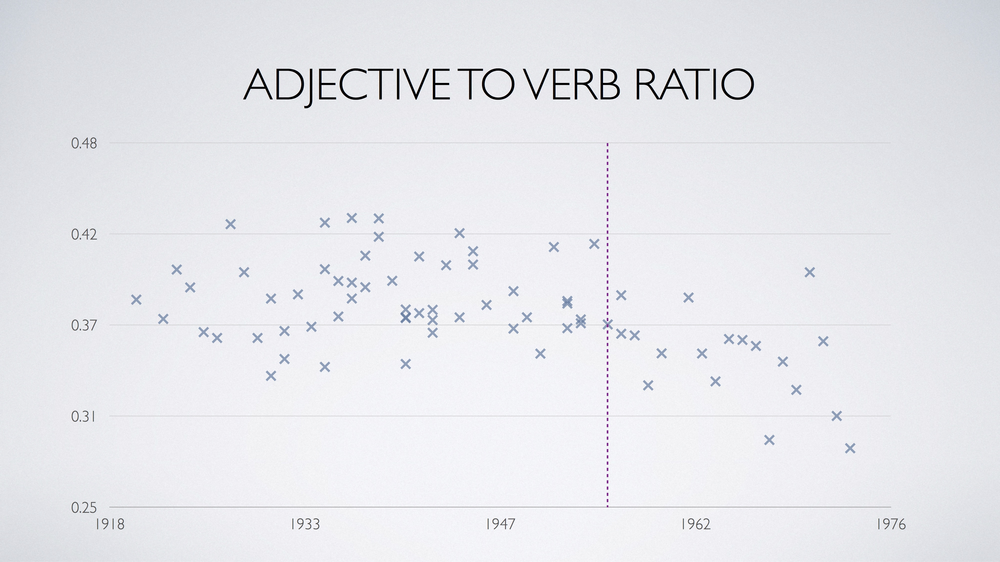

# And Then There Were None
Dementia affects more than one third of adults over 85 years old and one in nine adults over 65.  Alzheimer's Association estimates that half of people with Alzheimer's do not know they have it.  It has been shown that Agatha Christie used fewer unique words and more indefinite words in her later novels.  I wanted to take this research further by uncovering other features and creating an early warning system.  And Then There Were None is a prototype for detecting dementia using authors' writings.

##  Model Summary
Features from various authors' novels were created using Natural Language Processing.  Parts of speech, syntactic structure, n-grams, and topic clustering were all examined.  The features with the most signal were input into a Gausssian KDE distribution and fit based on an author's earlier works.  Authors with dementia had their works post dementia onset slowly drift away from their fitted distribution, indicating a fundamental change in their writing.

## Visual Representation of Model
This is a contour plot of the first two principal components fit to a Gaussian KDE.  Each point represents a novel and is annotated with the author's age.  One interpretation of the plot is that the further outside the boundary the points are, the less the author resembles his/her previous self.  Drops appear in chronological order.  
Someone suffering from dementia should have their later writings leave the boundary while someone not suffering from dementia should have their later writings stay within the boundary.

#### Agatha Christie - Had Dementia

#### Ross MacDonald - Had Dementia

#### Stephen King - No Known Dementia

## Data Analysis
Interesting features (Agatha Christie) that stood out:

## Model Instructions
1. Create tables of parsed books using create_tables.py.  Must input a database with name of books, year of publications, and text of books
2. Create features from parsed books using create_features.py
3. Create model with alz_model.py.  Fit model to data, then predict values or make plots.

## Technologies Used
* Python
* Numpy
* Pandas
* PostgreSQL
* Sklearn
* NLTK
* SpaCy

